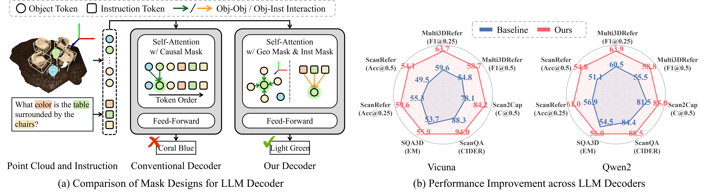

<div align="center">

<h2>[CVPR 2026] Masking Matters: Unlocking the Spatial Reasoning Capabilities of LLMs<br>for 3D Scene-Language Understanding</h2>


[Yerim Jeon](https://scholar.google.com/citations?user=pPtv7yYAAAAJ&hl=ko), [Miso Lee](https://scholar.google.com/citations?user=uSny0V0AAAAJ&hl=ko), [WonJun Moon](https://wjun0830.github.io/), [Jae-Pil Heo](https://scholar.google.com/citations?user=VXyJ_ssAAAAJ&hl=en)

<br>

[](https://arxiv.org/abs/2512.02487)


<p align="center">
  
  <br>
  <em>TLDR: We identify two major issues in conventional LLM decoders: spurious order-dependent correlations and limited instruction-object token interaction. To address both, we propose 3D Spatial Language Instruction Mask (3D-SLIM), an efficient and easily integrable solution that generalizes across various baselines and 3D scene-language tasks.</em>
</p>
</div>


## News
- **[2026/03/23]** Support Vicuna-7B, Llama3-8B, and Qwen2-7B.
- **[2026/03/20]** Released the paper and code of 3D-SLIM.


## Setup

First, clone the repository:
```sh
git clone https://github.com/Jyerim/3D-SLIM
cd 3D-SLIM
```

Then set up the environment using one of the following options:

**Option 1: Docker (Recommended)**

```sh
docker pull yerim0330/chatscene:torch2.7.1-cuda12.8-scatter
```

**Option 2: pip install**

**Step 1.** Install PyTorch (CUDA 12.8) and torch extensions:
```sh
pip install torch==2.7.1 torchvision==0.22.1 torchaudio==2.7.1 \
    --index-url https://download.pytorch.org/whl/cu128

pip install torch-geometric torch-scatter torch-sparse
```

**Step 2.** Install the remaining dependencies:
```sh
pip install -r requirements.txt
```

**Step 3.** Install Java (required for METEOR metric):
```sh
apt-get install -y default-jre
```


## Data Preparation

**Option 1: Download preprocessed data**

We provide all preprocessed data on [OneDrive](https://1drv.ms/f/c/e86f3d35728981e7/IgDkZMdZxxirQL7b7Z2Qrt4tAQhipl1s9eIwKwewsW5nDHU?e=nmpGEH).

Download and place the files in the `annotations/` directory — no further steps needed.

**Option 2: Prepare from scratch**

For full data preparation steps (ScanNet, Mask3D, 3D/2D feature extraction, etc.), follow the [Chat-Scene preprocess guide](https://github.com/ZzZZCHS/Chat-Scene/tree/dev/preprocess).

Once ready, configure the paths in `preprocess/run_prepare.sh` and run:
```sh
bash preprocess/run_prepare.sh
```


## Model Checkpoints

We provide model checkpoints for each LLM backbone:

<table>
  <thead>
    <tr>
      <th rowspan="2">Model</th>
      <th colspan="2">ScanRefer</th>
      <th colspan="2">Multi3DRefer</th>
      <th colspan="2">Scan2Cap</th>
      <th colspan="2">ScanQA</th>
      <th colspan="2">SQA3D</th>
    </tr>
    <tr>
      <th>Acc@0.25</th><th>Acc@0.5</th>
      <th>F1@0.25</th><th>F1@0.5</th>
      <th>C@0.5</th><th>B-4@0.5</th>
      <th>C</th><th>B-4</th>
      <th>EM</th><th>EM-R</th>
    </tr>
  </thead>
  <tbody>
    <tr>
      <td><a href="https://1drv.ms/u/c/e86f3d35728981e7/IQAJq-2nU-UMTbP7vZPRwTAHATjsPsqJHN8PSfOslt8Ye18?e=vlu9uF">Vicuna-7B + Ours</a></td>
      <td>59.6</td><td>54.1</td>
      <td>63.7</td><td>58.7</td>
      <td>84.2</td><td>38.0</td>
      <td>94.0</td><td>15.2</td>
      <td>55.9</td><td>58.9</td>
    </tr>
    <tr>
      <td><a href="https://1drv.ms/u/c/e86f3d35728981e7/IQDNUdXDmEU3TZsxbm4_iUh7AambcW18JMCypUdxGRCnbCQ?e=rT1P3T">Llama3-8B + Ours</a></td>
      <td>61.8</td><td>55.7</td>
      <td>64.3</td><td>59.2</td>
      <td>85.1</td><td>38.8</td>
      <td>85.1</td><td>15.6</td>
      <td>56.3</td><td>59.2</td>
    </tr>
    <tr>
      <td><a href="https://1drv.ms/u/c/e86f3d35728981e7/IQDjU_u9ZNifS6OqLQXJCYszAV0bf1o_FoUpvUT-m6vy0UI?e=9Q9txD">Qwen2-7B + Ours</a></td>
      <td>61.0</td><td>54.8</td>
      <td>63.9</td><td>58.8</td>
      <td>85.0</td><td>38.9</td>
      <td>88.5</td><td>15.9</td>
      <td>56.0</td><td>59.2</td>
    </tr>
  </tbody>
</table>

Place the downloaded checkpoint under `outputs/<model_name>/`.


## Training

Before running, download the LLM weights of your choice and place them under `llm/`:

| Model | Variant | Link |
|-------|---------|------|
| Vicuna | `vicuna-7b-v1.5` | [Download](https://huggingface.co/lmsys/vicuna-7b-v1.5) |
| LLaMA3 | `Meta-Llama-3-8B-Instruct` | [Download](https://huggingface.co/meta-llama/Meta-Llama-3-8B-Instruct) |
| Qwen2 | `Qwen2-7B-Instruct` | [Download](https://huggingface.co/Qwen/Qwen2-7B-Instruct) |

Then modify the following variables in `scripts/run.sh`:

| Variable | Description |
|----------|-------------|
| `OUTPUT_DIR` | Directory where checkpoints and logs will be saved |
| `llm_model_path` | Path to LLM weights under `llm/` |
```sh
bash scripts/run.sh
```

<details>
<summary><b> Explanation of <code>train_tag</code> and <code>val_tag</code></b></summary>
<br>

Use `#` to separate different datasets.

| Tag | Dataset |
|-----|---------|
| `scanrefer` | [ScanRefer](https://github.com/daveredrum/ScanRefer) |
| `scan2cap` | [Scan2Cap](https://github.com/daveredrum/Scan2Cap) |
| `scanqa` | [ScanQA](https://github.com/ATR-DBI/ScanQA) |
| `sqa3d` | [SQA3D](https://github.com/SilongYong/SQA3D) |
| `multi3dref` | [Multi3dRefer](https://github.com/3dlg-hcvc/M3DRef-CLIP) |
| `nr3d_caption` | Captioning dataset from [Nr3D](https://github.com/referit3d/referit3d) |
| `obj_align` | Alignment dataset from ScanRefer |

</details>


## Evaluation

Before running, modify the following variables in `scripts/eval.sh`:

| Variable | Description |
|----------|-------------|
| `pretrained_path` | Path to trained checkpoint (e.g. `outputs/<model_name>/ckpt_01_6890.pth`) |
| `OUTPUT_DIR` | Directory where evaluation results will be saved |
```sh
bash scripts/eval.sh
```

## BibTeX

If you find our work helpful, please consider citing:
```bibtex
@article{jeon2025masking,
  title={Masking Matters: Unlocking the Spatial Reasoning Capabilities of LLMs for 3D Scene-Language Understanding},
  author={Jeon, Yerim and Lee, Miso and Moon, WonJun and Heo, Jae-Pil},
  journal={arXiv preprint arXiv:2512.02487},
  year={2025}
}
```